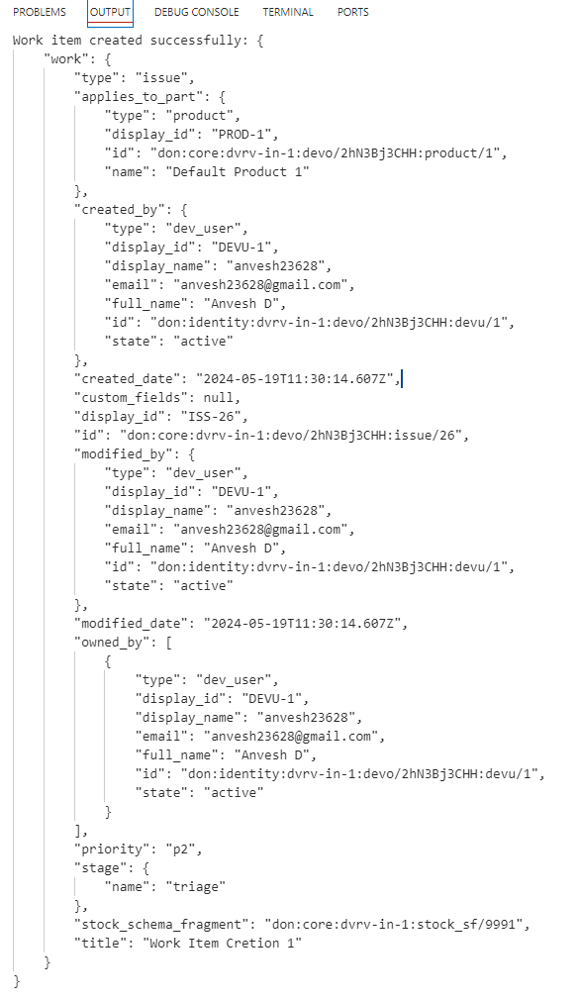

# DevRev Work Item Creation

The current folder contains the code for the creation of a work item using Python by sending a POST request to the DevRev `works.create` endpoint.

## Setup

1. Create a `secrets.txt` file and add the following content:
   ```plaintext
   PAT="<Personal access token>"

# Result
